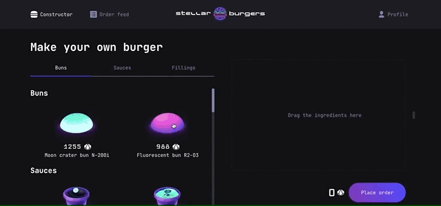
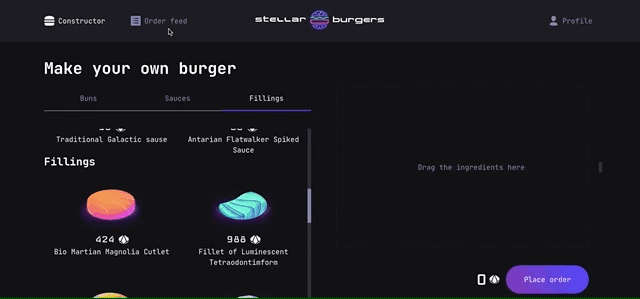
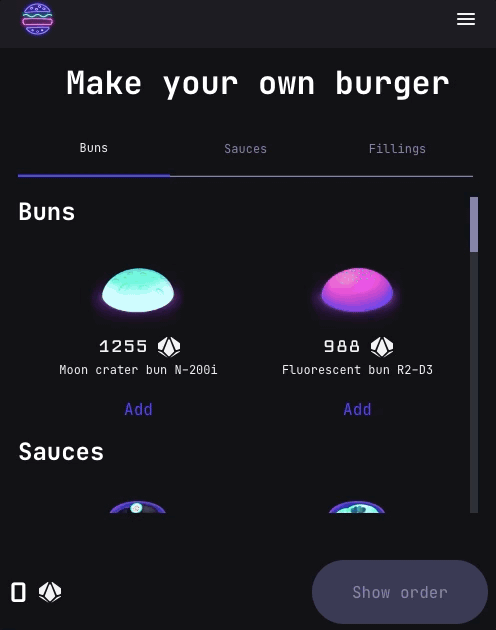

# Stellar Burger 

This is a burger ordering application that allows users to build their own burgers using different ingredients. Only authorized users can place orders. The app also features real-time order tracking on the server and a personal order history for each user.

Visit the app on [GITHUB-PAGES](https://palinakarabovich.github.io/react-burger/). (email: cat@cat.cat, password: cat123 or create your own account)

## Features
- User registration
- Build your burger using Drag and Drop functionality
  
- Real-time order tracking using WebSockets
- User profile with the ability to change name, password, and email
- Personal order history in the user's profile
- View detailed information about an ingredient by clicking on it
- View detailed information about an order by clicking on it
  
- Design is responsive
  

## Technologies
- React
- React-dnd
- Redux Toot Kit
- Redux Thunk
- WebSockets
- Typescript
- Jest
- Cypress

## Getting Started

1. Clone the repository.
2. Install dependencies with `npm install`.
3. Run the app with `npm start`.
4. Navigate to [localhost](http://localhost:3000/react-burger) in your browser to view the app.

## Testing
- Run unit tests with `npm run test`.
- Run end-to-end tests with `npm run cypress`.
